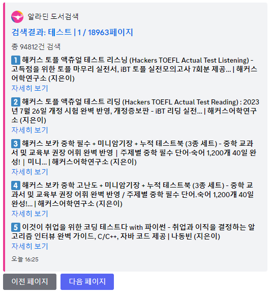

# discord-aladin

 알라딘 도서 검색 API를 이용한 디스코드 봇 [바로 추가하기](https://discord.com/oauth2/authorize?client_id=1170272295827279914)

유저 봇 형태로 설치가 가능하기 때문에, 한번 설치하면 어느 서버에서나 사용할 수 있습니다. 물론, 서버에도 설치 가능해요.

## search 명령어

알라딘 검색 결과 목록을 보여줍니다. 페이지 변경 버튼을 통해 여러 페이지를 볼 수 있습니다.

## show 명령어

검색된 책 목록에서 책 한권을 골라 자세한 정보를 보여줍니다.

## oldshow 명령어

기존 select menu를 이용한 인터페이스를 가지고 있습니다.

